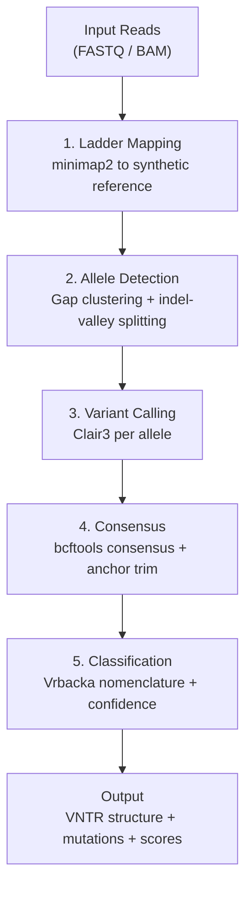
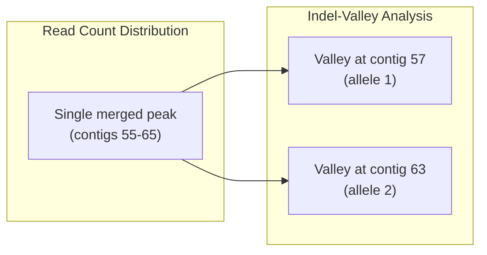

# Core Concepts

Understanding the fundamental concepts behind open-pacmuci helps you interpret results accurately and troubleshoot edge cases.

---

## Pipeline Architecture

open-pacmuci executes five stages sequentially. Each stage produces intermediate files that feed into the next.



---

## Reference Ladder

The first stage maps reads against a **synthetic reference ladder** -- a FASTA file containing 150 contigs, each representing a MUC1 VNTR with a different number of repeat units (1 to 150).

**Each contig is structured as:**

```
[flanking 500bp] [pre-repeats 1-5] [N x canonical 60bp X repeat] [after-repeats 6-9] [flanking 500bp]
```

**Why a ladder?**

Reads from a given allele will map best to the contig whose repeat count matches the allele length. By counting how many reads align to each contig (via `samtools idxstats`), the pipeline identifies the two allele lengths as peaks in the read count distribution.

!!! note "Ladder range"
    The default ladder spans 1-150 repeat units, covering the full observed range of MUC1 VNTR alleles (Vrbacka et al. report alleles up to 125 repeats). The original PacMUCI used 1-120.

---

## Allele Detection

### Gap-Based Clustering

The primary allele detection method looks for a **gap** in the read count distribution across contigs. Two distinct peaks separated by zero-count contigs indicate two alleles of different lengths.

### Indel-Valley Splitting

When two alleles differ by fewer than ~10 repeats, their read count distributions overlap, creating a single broad peak instead of two. **Gap-based clustering cannot separate them.**

open-pacmuci solves this with **indel-valley analysis**:

1. For each contig with mapped reads, compute the **mean CIGAR indel length** of all reads
2. Reads aligned to the correct-length contig have near-zero indels
3. Reads aligned to a wrong-length contig have large indels (~60bp per repeat of mismatch)
4. Two **local minima (valleys)** in the indel series correspond to the two true allele lengths



!!! tip "Benchmark result"
    Indel-valley splitting resolves allele pairs as close as 3 repeats apart. 12/12 close allele pairs in the test suite are correctly resolved.

---

## Variant Calling

After allele detection, reads are partitioned by allele and **remapped to the corresponding peak contig**. Clair3 is then run independently per allele using the PacBio HiFi model.

**Key details:**

- **Per-allele calling** -- each allele gets its own Clair3 run against its peak contig
- **VCF quality filtering** -- variants are filtered by QUAL and genotype quality
- **Empty VCF handling** -- if Clair3 finds no variants (normal allele), the pipeline continues gracefully
- **Same-length alleles** -- disambiguated using Clair3 heterozygous genotype detection

!!! warning "Clair3 model required"
    You must provide a path to the Clair3 HiFi model via `--clair3-model`. Without it, variant calling will fail.

---

## Consensus Construction

**bcftools consensus** applies Clair3 variants to the reference contig to build a per-allele consensus FASTA. The consensus represents the actual VNTR sequence of each allele.

**Anchor-based flanking trim:**

After consensus construction, the pipeline trims flanking sequences using **anchor-based boundary detection** rather than fixed-position trim. This is resilient to indels in the flanking region caused by Clair3 false positive calls near the VNTR boundaries.

---

## Repeat Classification

Each consensus sequence is split into 60bp units and classified using the **Vrbacka nomenclature**.

### Classification Strategy

1. **Exact match** -- compare each 60bp unit against all known repeat type sequences
2. **Mutation template probing** -- if no exact match, compare against pre-computed mutation templates (13 known mutations)
3. **Edit distance fallback** -- if no template matches, find the closest repeat type by Levenshtein distance and report as a novel mutation

### Mutation Template Matching

For known mutations (e.g., dupC), the pipeline has **pre-computed the exact sequence** that each repeat type would have after the mutation is applied. This enables O(1) lookup:

```
Input:  60bp unit from consensus
Step 1: Check exact match against ~50 known repeat types     --> match? done
Step 2: Check exact match against ~650 mutation templates     --> match? report mutation
Step 3: Compute edit distance against all repeat types        --> report as novel
```

### Confidence Scoring

Each classified repeat receives a **confidence score** (0.0 to 1.0):

- **1.0** -- exact match to a known repeat type or mutation template
- **0.8-0.99** -- close match (1-2 substitutions from a known type)
- **< 0.8** -- low confidence, may indicate sequencing error or novel variant

The **allele confidence** is the mean of all per-repeat confidences. VCF cross-validation can further adjust scores when Clair3 variants confirm or contradict the classification.

---

## Next Steps

- **[Deviations from PacMUCI](deviations.md)** -- What changed and why
- **[Known Mutations](../reference/mutations.md)** -- Full mutation catalog
- **[Repeat Nomenclature](../reference/nomenclature.md)** -- Classification system details
- **[Benchmarking](../guides/benchmarking.md)** -- Validate with simulated data
